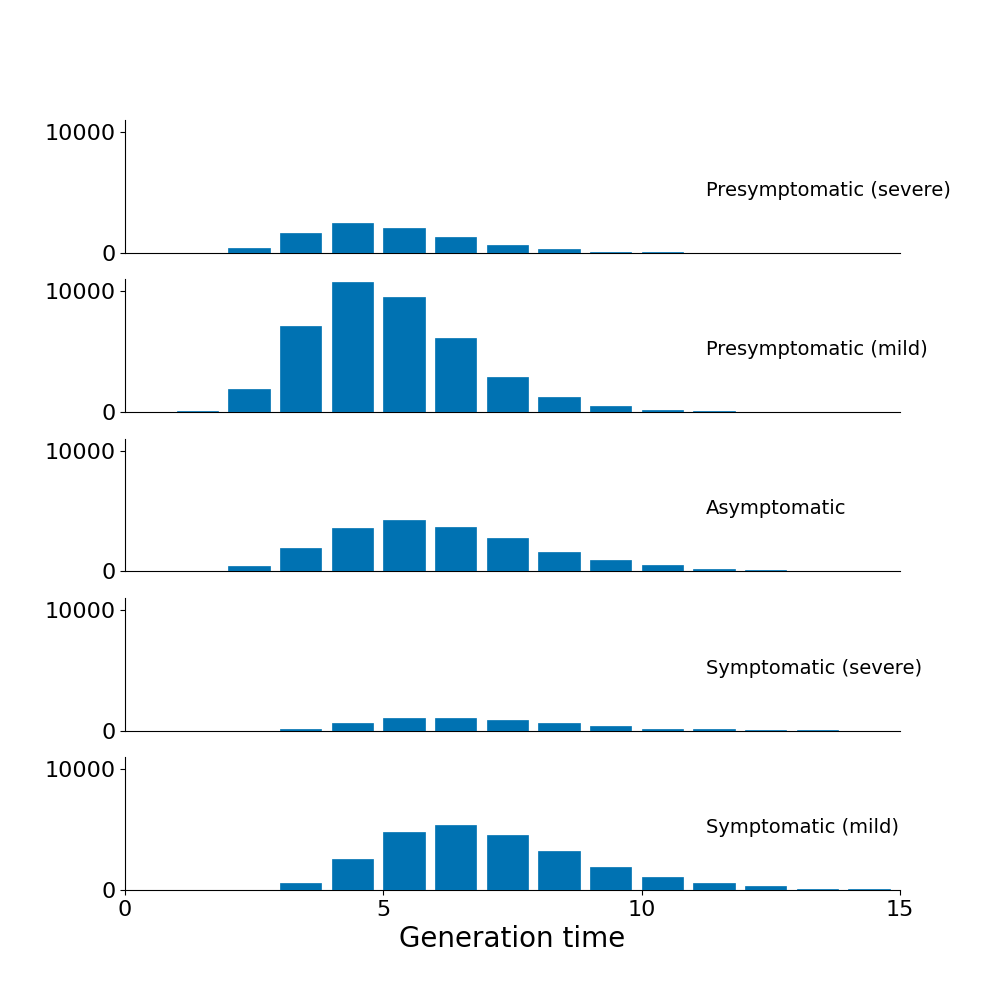
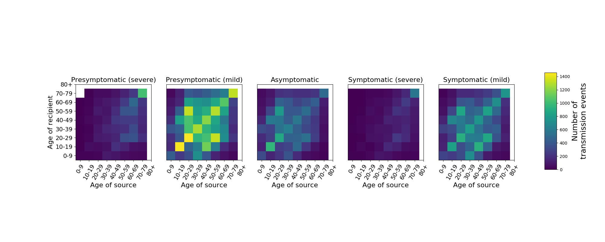
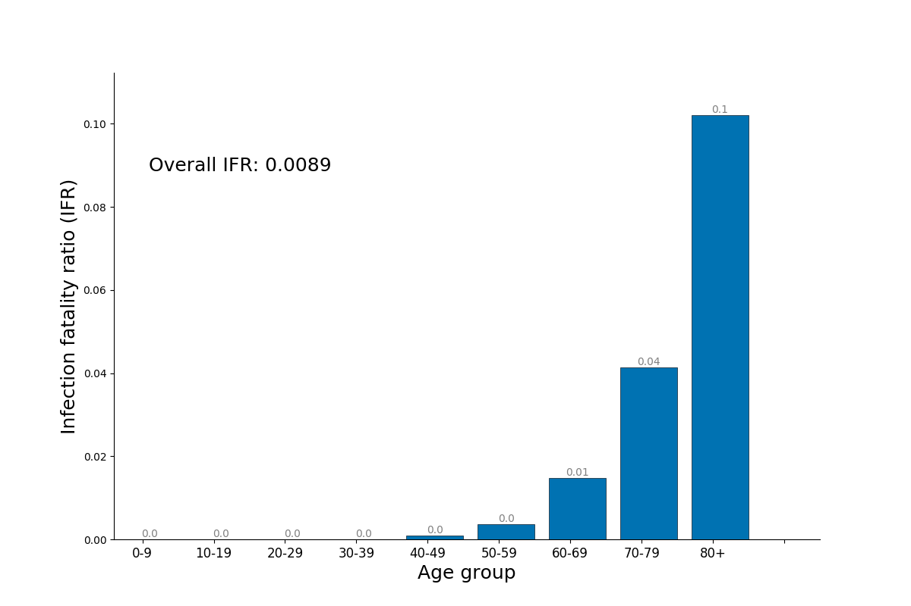

# Figures for manuscript on the OpenABM-Covid19 model

## Usage

* `step0_set_up.sh`: clone the OpenABM-Covid19 model, creates a virtual environment into which the model, and prerequisites, are installed
* `step1_run_model.sh`: runs the OpenABM-Covid19 model in a population of 1 million with demographics and control interventions similar to the UK.  Model output is stored in the `results` folder.  
* `step2_create_figures.sh`: runs python scripts to generate figures for the paper from model output

### Figure 3

Histogram of generation time of simulated transmission events stratified by infectious state of the source.  Generation time is the time from infection to transmission.  Data is from a single simulation in a population of 1 million individuals with UK-like demographics and COVID19 control interventions.  

### Figure 4

Summary of transmission events from a single simulated uncontrolled epidemic stratified by age of both source and recipient and by infectious status of the source of the infection.

### Figure 6

Age-stratified infection fatality ratio as output from a single simulation in a population of 1 million with UK-like demography and control interventions.  

