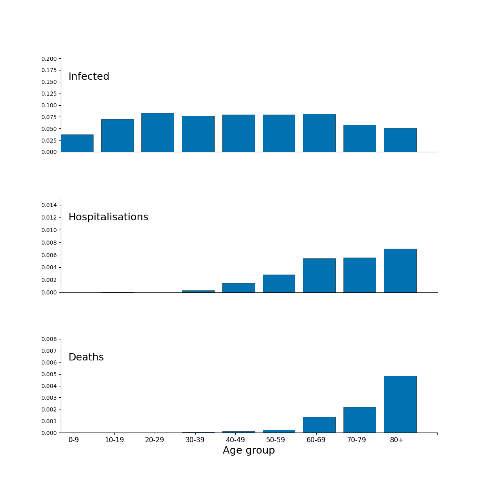
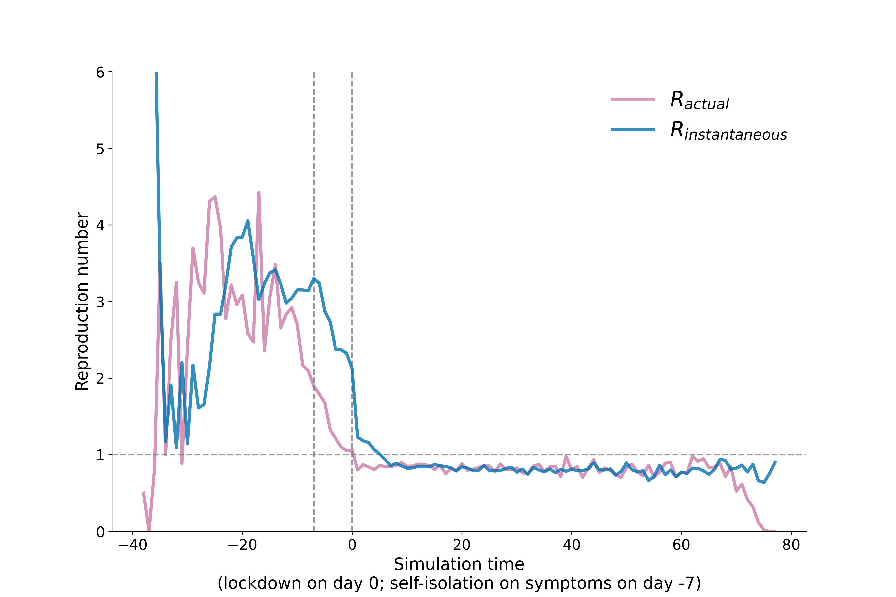

# `OpenABM-Covid19-model-paper`

Analysis repo to generate tables, figures for manuscript on the OpenABM-Covid19 model [(Hinch, Probert et al., 2020)](https://www.medrxiv.org/content/10.1101/2020.09.16.20195925v1).  

## Software requirements

To generate the data, one needs to install [OpenABM-Covid19](https://github.com/BDI-pathogens/OpenABM-Covid19), the requirements for which are listed on the README.md of the OpenABM-Covid19 repo.  For generation of the figures and tables in this repo, one needs Python>3.6 (other package requirements should be satisfied if OpenABM is already running) and R >3.4.  


The scripts herein assume OpenABM-Covid19 is cloned as a subdirectory of this repo (or it could be pulled using `git submodule`, for instance).  
```
model_dir="OpenABM-Covid19"
release="0.3"

cd OpenABM-Covid19-model-paper
git clone https://github.com/BDI-pathogens/OpenABM-Covid19.git "$model_dir"
(cd "$model_dir"; git checkout "$release")
```

We recommend running these analyses with a Python virtual environment.  A virtual environment can be set up, activated, and prerequisites installed in the following manner: 

```
python3 -m venv venv
source venv/bin/activate
pip install -r "$model_dir/tests/requirements.txt"
(cd $model_dir/src; make clean; make)
```

The virtual environment can be deactivated using `deactivate`.  

## Usage

* `make all`: Will generate the simulated data, and generate all figures and tables used in the paper.  
* `make all_output`: Generate all figures and tables used in the paper (without generating the simulated data).  


**Additional commands**

* `make data`: Generate simulation data for a population of 1M with UK-like demographics and controls (self-isolation on symptoms, self-isolate on positive test result, lockdown when prevalence reaches 2% in the population).  

All figures and tables can be generated individually in the following manner (after the data have been generated): 

* `make figure1`: Generate figure 1, etc
* `make figureS1`: Generate figure S1, etc
* `make table1`: Generate table 1, etc


## Output figures

### Figure 1

Figure 1 is a schematic of the networks used in the model.  

### Figure 2

Figure 2 is a composite figure, the subpanels are produced in this repository

### Figure 3

Heatmap of transmission events between different age groups for different infectiousness states of the source of infection.  Data is from a single simulation in a population of 1 million individuals with UK-like demographics and COVID19 control interventions.  


### Figure 4

Age-stratified infection fatality ratio as output from a single simulation in a population of 1 million with UK-like demography and control interventions.  


### Figure 5

Figure 5 is a fit of the model using baseline parameters to observed data for England and Wales (using minimal calibration).  

### Figure 6

Figure 6 is a schematic representation of the different infectiousness and disease compartments in the model.  

### Figure S1



### Figure S2


### Figure S3

Waiting time distributions for transitions between infection and disease states.


### Figure S4

App uptake


### Figure S13

Reproduction number calculated from the transmission file and timeseries file



