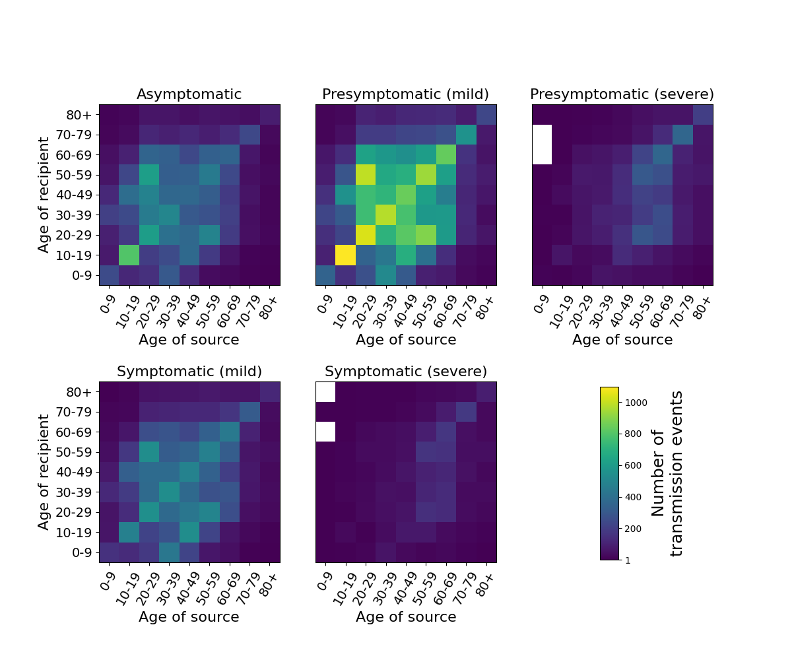
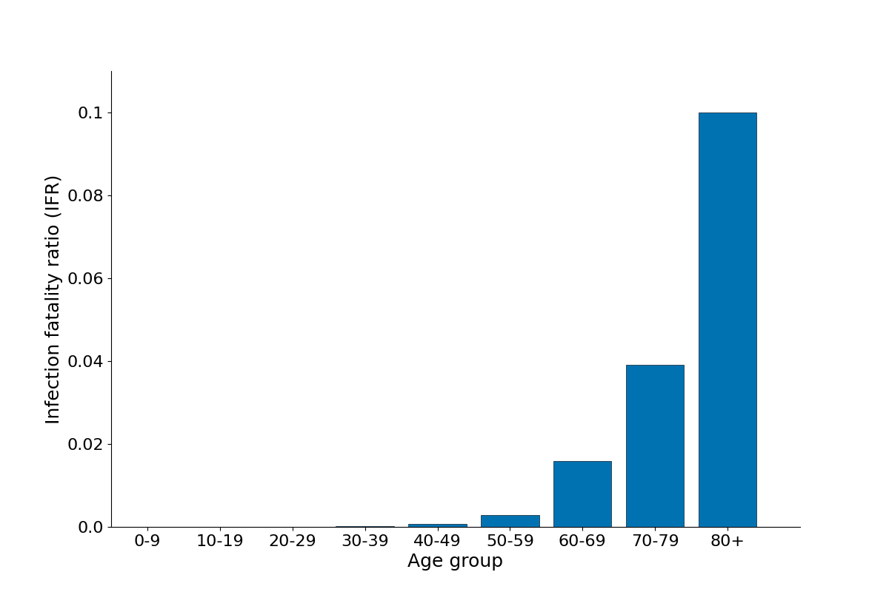

# `OpenABM-Covid19-model-paper`

Analysis repo to generate tables, figures for manuscript on the OpenABM-Covid19 model [(Hinch, Probert et al., 2020)](https://www.medrxiv.org/content/10.1101/2020.09.16.20195925v1).  

## Software requirements

To generate the data, one needs to install [OpenABM-Covid19](https://github.com/BDI-pathogens/OpenABM-Covid19), the requirements for which are listed on the README.md of the OpenABM-Covid19 repo.  For generation of the figures and tables in this repo, one needs Python>3.6 (other package requirements should be satisfied if OpenABM is already running) and R >3.4.  

## Usage

* `step0_set_up.sh`: clone the OpenABM-Covid19 model, creates a virtual environment into which the model, and prerequisites, are installed
* `step1_run_model.sh`: runs the OpenABM-Covid19 model in a population of 1 million with demographics and control interventions similar to the UK.  Model output is stored in the `results` folder.  
* `step2_create_figures.sh`: runs python scripts to generate figures for the paper from model output

### Figure 3

Heatmap of transmission events between different age groups for different infectiousness states of the source of infection.  Data is from a single simulation in a population of 1 million individuals with UK-like demographics and COVID19 control interventions.  

### Figure 4

Summary of transmission events from a single simulated uncontrolled epidemic stratified by age of both source and recipient and by infectious status of the source of the infection.

### Figure 5

Age-stratified infection fatality ratio as output from a single simulation in a population of 1 million with UK-like demography and control interventions.  

### Figure S2

Waiting time distributions for transitions between infection and disease states.
